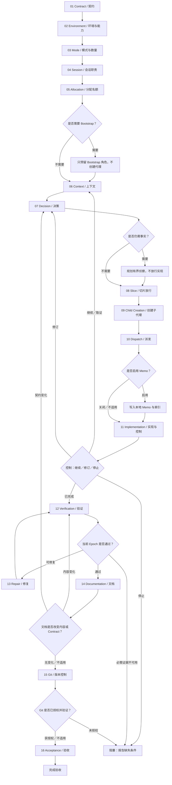

# Coding 工作流——多代理模式

[English](coding-multi-agent.md) | [简体中文](coding-multi-agent_zh_cn.md)

本路线由 Coding 工作流选择；只有模式检查点放行多代理 Coding 后才有效。执行前，该检查点组合[模式确认](../layer-01-fundamental-concepts/delegation-mode-confirmation_zh_cn.md)、[数量门禁](../layer-01-fundamental-concepts/delegation-mode-count-gate_zh_cn.md)、[模式重新进入](../layer-01-fundamental-concepts/delegation-mode-reentry_zh_cn.md)、[状态记录](../layer-01-fundamental-concepts/delegation-state-record_zh_cn.md)、[子代理创建](../layer-01-fundamental-concepts/delegation-child-creation_zh_cn.md)、[子代理职责分配](../layer-01-fundamental-concepts/delegation-child-role-allocation_zh_cn.md)、[子代理派发](../layer-01-fundamental-concepts/delegation-child-dispatch_zh_cn.md)、[子代理复用/替换](../layer-01-fundamental-concepts/delegation-child-reuse-replacement_zh_cn.md)和[子代理生命周期](../layer-01-fundamental-concepts/delegation-child-lifecycle_zh_cn.md) owner。

## 工作流路线图



编号节点与下方唯一路线顺序检查清单一一对应。未触发的条件概念记录 `Not applicable` 原因；路线图只负责概念选择和排序，具体动作、证据与失败处理以清单及同语言 owner 为准。

## 模式 Contract

- Worker 接收一个已发布的 Interaction Slice，只能通过父级控制的通道返回；不得递归创建层级，也不得把其他 Worker 的进度当作授权。
- [模式确认](../layer-01-fundamental-concepts/delegation-mode-confirmation_zh_cn.md)、[数量门禁](../layer-01-fundamental-concepts/delegation-mode-count-gate_zh_cn.md)、[模式重新进入](../layer-01-fundamental-concepts/delegation-mode-reentry_zh_cn.md)和[状态记录](../layer-01-fundamental-concepts/delegation-state-record_zh_cn.md) owner 分别负责各自的根模式、数量、重新进入和状态记录边界；[子代理创建](../layer-01-fundamental-concepts/delegation-child-creation_zh_cn.md)、[子代理职责分配](../layer-01-fundamental-concepts/delegation-child-role-allocation_zh_cn.md)、[子代理派发](../layer-01-fundamental-concepts/delegation-child-dispatch_zh_cn.md)、[子代理复用/替换](../layer-01-fundamental-concepts/delegation-child-reuse-replacement_zh_cn.md)和[子代理生命周期](../layer-01-fundamental-concepts/delegation-child-lifecycle_zh_cn.md) owner 负责对应的子代理边界。职责名称不能独立授权 Session。
- 如果用户禁止子代理、子任务、独立 Session 或并行委派，应停止本路线并返回路线选择，不得模拟多代理行为。

## 组合输入

本路线组合[共享协议](../../share/shared-protocols_zh_cn.md)、[委派状态记录](../layer-01-fundamental-concepts/delegation-state-record_zh_cn.md)、[模式确认 reference](../layer-01-fundamental-concepts/delegation-mode-confirmation_zh_cn.md)、[模式/数量门禁](../layer-01-fundamental-concepts/delegation-mode-count-gate_zh_cn.md)、[模式重新进入 reference](../layer-01-fundamental-concepts/delegation-mode-reentry_zh_cn.md)、[子代理创建](../layer-01-fundamental-concepts/delegation-child-creation_zh_cn.md)、[子代理职责分配](../layer-01-fundamental-concepts/delegation-child-role-allocation_zh_cn.md)、[子代理派发](../layer-01-fundamental-concepts/delegation-child-dispatch_zh_cn.md)、[子代理复用/替换](../layer-01-fundamental-concepts/delegation-child-reuse-replacement_zh_cn.md)、[子代理生命周期](../layer-01-fundamental-concepts/delegation-child-lifecycle_zh_cn.md)、[Session 模型](../layer-01-fundamental-concepts/session-model_zh_cn.md)、[Session 职责归属](../layer-01-fundamental-concepts/session-role-ownership_zh_cn.md)、[Session Context Firewall](../layer-01-fundamental-concepts/session-context-firewall_zh_cn.md)和[执行控制](../layer-01-fundamental-concepts/execution-control_zh_cn.md)；只有已发布切片需要时才加载[上下文交换](../layer-01-fundamental-concepts/context-exchange_zh_cn.md)、[上下文工作区边界](../layer-01-fundamental-concepts/context-exchange-workspace-boundary_zh_cn.md)、[上下文 handoff](../layer-01-fundamental-concepts/context-exchange-handoff_zh_cn.md)或[内容 memo](../layer-01-fundamental-concepts/content-memo_zh_cn.md)。模式检查点已经验证任务记录；下方检查点列表是完整的路线组合。

## 职责边界

职责 ownership 见[Session 职责归属](../layer-01-fundamental-concepts/session-role-ownership_zh_cn.md)；本路线只增加下方的多代理条件。

## 本路线的运行环境要求

使用[运行环境能力清单](../layer-02-workflow-concepts/environment-capability-inventory_zh_cn.md)提供的能力清单和共用运行规则，包括[运行环境与模型厂商支持](../layer-01-fundamental-concepts/runtime-provider-support_zh_cn.md)中的模型绑定。只有任务记录和已发布切片所需能力均暴露时才能继续。Worker 只能向直接父级返回，不能创建/管理其他 Agent 或联系任意线程。

## 路线顺序检查清单

按编号顺序执行每一阶段。对每个链接的 owner，核对适用动作和通过条件，记录结果及证据；必需结果缺失时停止。条件动作不适用时，逐项记录 `Not applicable` 及原因；存在链接或早期摘要不等于已经完成检查。Coding 选择器已在进入路线前完成第 1–3 阶段：核查其放行证据，不重复运行门禁。根父级负责语义决策并控制每次放行；Worker 只能向该父级返回。

1. **Contract 与共用协议。** 确认 [Contract 检查点](../layer-02-workflow-concepts/contract_zh_cn.md)明确目标、用户/运行环境/仓库/权限/安全硬约束、已授权影响、已定决策、未解决问题和验收条件。应用[共享协议](../../share/shared-protocols_zh_cn.md)：维护一份当前 Semantic Contract，区分已观察事实与假设，保持稳定前缀并以小幅增量发送有界修订，使用仅向父级返回的路径及简短 Dispatch Preview；必需上下文或返回路径不可用时停止依赖切片。不得把未解决的问题当作派发授权。
2. **运行环境与能力。** 确认[运行环境检查点](../layer-02-workflow-concepts/environment_zh_cn.md)依据明确元数据将环境归入唯一分支，工具和工作区信息只作辅助证据；不得用浏览器、GUI 或视觉内容识别运行环境。分类仍有歧义时，使用厂商 owner 的原文兜底问题并暂停。检查[运行环境能力清单](../layer-02-workflow-concepts/environment-capability-inventory_zh_cn.md)中的真实模型、Profile 所需参数、子代理身份、父级控制的返回路径、有界等待、生命周期、文件系统/权限范围和工具。按[运行环境与模型厂商支持](../layer-01-fundamental-concepts/runtime-provider-support_zh_cn.md)应用分支特定的模型绑定。把缺失或未知要求记入 `unavailable_capabilities`；阻塞依赖工作，不得推断或替换能力。
3. **模式、数量与记录。** 确认[模式](../layer-02-workflow-concepts/mode_zh_cn.md)放行 Multi-Agent；根据[模式确认](../layer-01-fundamental-concepts/delegation-mode-confirmation_zh_cn.md)、[数量门禁](../layer-01-fundamental-concepts/delegation-mode-count-gate_zh_cn.md)、[状态记录](../layer-01-fundamental-concepts/delegation-state-record_zh_cn.md)与[重新进入](../layer-01-fundamental-concepts/delegation-mode-reentry_zh_cn.md)，核对已锁定正整数数量、`gate_status: released` 和恰好 `child_count` 个初始 `agent: unbound`、`role: unassigned`、`slice_status: pending` 的预留名额。此时只放行路线与数量预算，不授权任何具体 Slice 或 Child Creation；后续指令沿用锁定拓扑。缺少必需记录或能力则阻塞。
4. **Session 职责与 Context Firewall。** 核对 [Session 模型](../layer-01-fundamental-concepts/session-model_zh_cn.md)和[职责归属](../layer-01-fundamental-concepts/session-role-ownership_zh_cn.md)：根父级直接分析指令、项目环境和定义每个子任务所需的代码细节，负责 Contract、决策和验收，并放行精确范围。获分配的 Primary Session 负责实现；已分配 verifier 负责只读独立检查；文档/Git 角色只负责各自另行发布的工作。未分配职责不构成独立 Session。应用 [Context Firewall](../layer-01-fundamental-concepts/session-context-firewall_zh_cn.md)：父级只作有界侦察，Worker 只消费已放行原始状态，返回带源指针的压缩事实。
5. **分配与子代理预算。** 按[子代理职责分配](../layer-01-fundamental-concepts/delegation-child-role-allocation_zh_cn.md)确认每个独立职责占用一个已锁定名额，不得虚构未分配的 verifier 或辅助角色。只有至少两个独立下游 Worker、宽范围探索且需路由至少三个策略模块，或源材料约超过 20k 字符 / 5k token-equivalents 时才分配 Context Bootstrap/Refresh。只有一个小 Worker 或仅文档快速路径时跳过，并记录原因。此时不要创建子代理：先在第 6–8 阶段确认相关事实、上下文、决策和已放行切片。 在本步为未绑定的预留名额分配职责；只有一个子代理时分配 Primary Output。不得回收已创建 Agent 的名额。
6. **上下文与传输。** 在 [Context](../layer-02-workflow-concepts/context_zh_cn.md)提出下一切片的最小问题，只读取必需源材料，并检查复用上下文的 owner、源路径、新鲜度和 epoch。Worker 需要文件交换时，应用[上下文交换](../layer-01-fundamental-concepts/context-exchange_zh_cn.md)：只传递中性事实、准确指针、哈希和新鲜度数据；bootstrap capsule 使用 `MANIFEST.md`、`project-context.md` 和 `policy-context.md`；优先使用权威源，并核对 HEAD/tree、已跟踪差异、所列源文件哈希、相关未跟踪状态及任务/范围新鲜度；拒绝过期 capsule，且 capsule 不能替代 Contract 或验证。应用[上下文工作区边界](../layer-01-fundamental-concepts/context-exchange-workspace-boundary_zh_cn.md)：父级设置 `CONTEXT_ROOT=<primary-worktree>/.token-io-decoupling/context/`，独占其中的 `INDEX.md`，确保运行时目录被 Git 忽略，准备各命名 Worker 目录和只读导入，并以真实隔离强制 RW/RO/DENY 路径；无法强制边界时停止，单独建立 worktree 不构成隔离。仅在具体交接或恢复时应用[上下文交接](../layer-01-fundamental-concepts/context-exchange-handoff_zh_cn.md)：记录已完成状态、带证据的失败尝试、当前改动与验证、阻塞和下一项有用动作；更新本地/根索引，只暴露命名的前任文档，并保留前任目录。不需要交换或交接时分别记录原因。 文件化 memo 与跨 Worker 交换是独立触发条件：即使无需跨 Worker 交换，启用 memo 时仍必须准备其 Worker 目录、索引与具名权限。Context ID 不授予创建 Agent 的权限。
7. **决策与两级规划。** 在 [Decision](../layer-02-workflow-concepts/decision_zh_cn.md)说明实质问题、事实、约束、选项、选定方向、舍弃方案、授权路径/修改和未发布边界。应用[决策门禁](../layer-01-fundamental-concepts/execution-decision-gate_zh_cn.md)：除非符合简单快速路径，否则先形成包含 Problem、Known facts、Assumptions and unknowns、Decision questions、Solution envelope、Risks、Acceptance 和 Stages/checkpoints 的简洁 Decision Brief；实质选择未定时只发布侦察。用[执行规划](../layer-01-fundamental-concepts/execution-planning_zh_cn.md)安排有界检查、实现和聚焦检查，并写明预期证据。分配任何子代理或实质派发前，确认 Contract 允许一个具体切片。
8. **切片与阶段放行。** 按[执行控制](../layer-01-fundamental-concepts/execution-control_zh_cn.md)写明 `Objective`、`Authorized scope/mutations`、`Return conditions` 和 `Unreleased boundary`；有依赖关系的写操作按顺序发布。对高不确定性工作应用[执行阶段反馈](../layer-01-fundamental-concepts/execution-stage-feedback_zh_cn.md)：预先声明短小、产出证据的阶段，将常规机械操作留在阶段内，只在实质边界返回压缩 Progress Signals。新的语义选择返回第 7 阶段。 只有 Context 和 Decision 已确认具体任务，才将其 allocation 标记为 `slice_status: released`；预留名额不授权创建子代理。
9. **创建子代理及生命周期。** 按[子代理创建](../layer-01-fundamental-concepts/delegation-child-creation_zh_cn.md)确认当前运行环境真实且由父级控制的子代理机制、已放行记录、锁定数量、计划名额、职责、切片、允许路径、返回条件和必需上下文，然后只创建授权子代理。厂商专属操作由所链接的 Layer-01 owner 确定。把子代理的实际身份/生命周期写回计划分配。应用[子代理生命周期](../layer-01-fundamental-concepts/delegation-child-lifecycle_zh_cn.md)：在父级记录中持久保留已创建子代理的身份和生命周期；不得仅因工作结束而清理持久任务面板条目；pending/running 时只等待或发送授权输入；收到最终证据后才标记完成；保留错误/中断状态。不得为错误恢复额外创建子代理。 仅在名额尚未绑定、职责已分配、`slice_status: released` 且必要能力可核验时创建子代理；已有 Agent 通过原身份复用，不得回收名额或创建替代者。
10. **派发、Worker 记录和 memo。** 应用[子代理派发](../layer-01-fundamental-concepts/delegation-child-dispatch_zh_cn.md)：父级先核实前置事实，发送约 1–3 行、80 token 的简短 Dispatch Preview，只命名获准代码/上下文路径；除非已批准独立且不冲突的工作，否则一次只发布一个切片。按 [Worker 边界](../layer-01-fundamental-concepts/delegation-worker-boundary_zh_cn.md)只传相关已放行记录快照；Worker 不得修改记录、重开门禁、协调同级或创建子代理；记录无法持久化或返回时阻塞派发。应用[内容 memo 派发](../layer-01-fundamental-concepts/content-memo-dispatch_zh_cn.md)：每个已发布任务包都显式写入 `write_content_memo: true | false`。启用时应用[内容 memo 约束](../layer-01-fundamental-concepts/content-memo_zh_cn.md)及[内容 memo 生命周期](../layer-01-fundamental-concepts/content-memo-lifecycle_zh_cn.md)：Worker 在 `content-memo.md` 或命名的等效文档中用中文叙述，只记录稳定事实/证据/修改路径，在实质里程碑更新，并可从 Worker 索引找到；不得写入秘密、原始完整日志、完整 diff 或逐命令日志。禁用时记录父级原因；不适用的职责不得创建无操作 Worker。 Memo 开启时核验步骤 6 的目录、权限和本地索引，关闭时记录理由并跳过物化。
11. **实现与控制。** 在 [Implementation](../layer-02-workflow-concepts/implementation_zh_cn.md)要求 Worker 重新读取已放行目标/范围/返回条件，只检查必需文件，实施最小授权改动，运行聚焦临时检查且不把它当作最终验收，并返回修改路径、证据、问题和未发布边界。在 [Control](../layer-02-workflow-concepts/control_zh_cn.md)由父级记录 `Status`、`Findings`、`Changed`、`Verification`、`Issue`、`Need` 和 `Unreleased boundary`，检查实质风险/范围/影响，并明确选择 Continue、Amend、Stop 或 Evidence-on-Demand。按[子代理复用/替换](../layer-01-fundamental-concepts/delegation-child-reuse-replacement_zh_cn.md)复用同一子代理处理授权后续工作；数量锁定后不得替换失败的子代理。其他获准切片才重复第 6–11 阶段。 `Evidence-on-Demand` 只是暂停放行并获取证据的中间动作，返回本 Control 后才从 `Continue`、`Amend`、`Stop` 中选择结果；消费 Progress Signal 而不重复汇报。
12. **最终状态验证。** 在 [Verification](../layer-02-workflow-concepts/verification_zh_cn.md)记录当前指纹和验收条件，针对该状态运行适用的整体与聚焦检查。应用[验证独立性](../layer-02-workflow-concepts/verification-independence_zh_cn.md)：需要时使用已分配的独立 verifier，否则将同一 Session 检查标为逻辑验证，并报告独立性不可用。应用[验证报告](../layer-02-workflow-concepts/verification-reporting_zh_cn.md)：记录通过、失败、不可用、假设、剩余风险、未解决项及阻塞影响。应用[验证 epoch](../layer-02-workflow-concepts/verification-epoch_zh_cn.md)：分别跟踪实现/内容、文档和 Git 元数据；对变化的覆盖范围使用当前证据重新评估，后续 epoch 复用已分配 verifier。必需证据仍有缺口时不得放行依赖工作。
13. **修复与重新验证。** 在 [Repair](../layer-02-workflow-concepts/repair_zh_cn.md)指出失败证据、受影响路径和最小候选修复。用[修复范围门禁](../layer-02-workflow-concepts/repair-scope-gate_zh_cn.md)确认与 Contract/Decision 兼容；实质决策变化返回第 1 和第 7 阶段。在[修复执行](../layer-02-workflow-concepts/repair-execution_zh_cn.md)只向现有子代理发布授权的窄范围修复，并运行聚焦检查。按[修复验证交接](../layer-02-workflow-concepts/repair-verification-handoff_zh_cn.md)记录新状态，返回第 12 阶段，优先交回同一已分配 verifier。发生中断时遵循生命周期/复用边界；数量锁定后同一子代理无法安全继续，就将路线标为 blocked，不得替换。没有失败时记录 Repair 不适用。 修复优先复用同一已创建子代理，更新受影响 Epoch 后重新执行步骤 12；无法安全复用时阻塞。
14. **文档。** 在 [Documentation](../layer-02-workflow-concepts/documentation_zh_cn.md)确认获准路径、读者、目的、源证据及验证边界；文档/注释作为与 Git 分开的有界范围发布。同步受维护的语言镜像，推进文档 epoch，并运行适用的 Markdown、链接、空白、多语言和范围检查。若内容改变行为、Contract 或验收，返回实现/内容验证；否则保留有效的产品证据。报告不可用检查。
15. **Git 影响。** 在 [Git](../layer-02-workflow-concepts/git_zh_cn.md)确认准确仓库、worktree、分支/ref、远端、操作和授权。检查状态/历史，保留无关改动，确认暂存/提交内容与最新已验证的内容及文档指纹一致。索引/提交/分支/历史变化属于 Git 元数据变化；commit、push、Issue、PR 等影响分别确认授权。目标不明、冲突、权限缺失或内容未经验证时停止。没有 Git 工作时记录原因。
16. **验收。** 在 [Acceptance](../layer-02-workflow-concepts/acceptance_zh_cn.md)把每项 Contract 验收条件映射到最新实现/内容、文档和 Git 元数据 epoch 的当前证据。核对路径/影响是否在范围内；分别报告通过、失败、未运行、不可用、假设和用户授权项及剩余风险。区分真实独立 Session 与同一 Session 的阶段；只有必需事项和边界均已解决，才能报告 `COMPLETE`。

第 8–10 阶段的每个已发布 Worker 任务包都显式写明以下字段：

```text
Owner: Primary Output | Documentation/Comments & Git Operations | Change Verification
Objective: ...
Authorized scope/mutations: ...
write_content_memo: true | false
Return conditions: ...
Unreleased boundary: ...
```

## 完成

执行根 Coding 完成门禁，处理文档、Git 和最终验收。最终报告必须区分真实独立 Session 与同一 Session 的逻辑阶段，并把每个验收条件映射到当前证据。

## 相关概念

- [共享协议](../../share/shared-protocols_zh_cn.md)——定位共用 Session 约定。
- [Session 职责归属](../layer-01-fundamental-concepts/session-role-ownership_zh_cn.md)——定位父级与 Worker 的职责。
